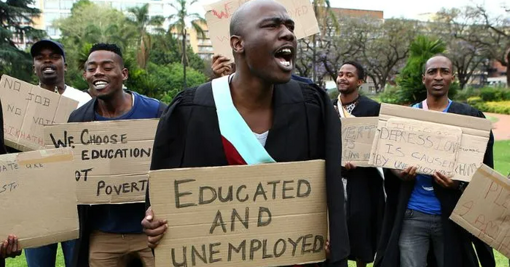
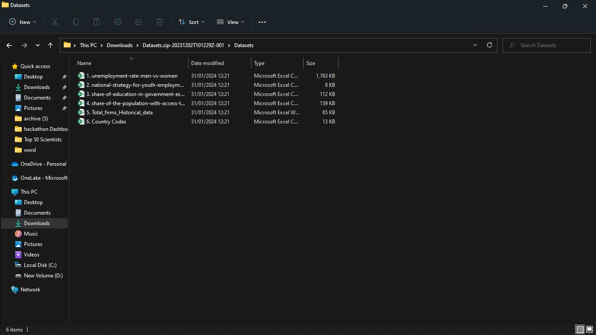
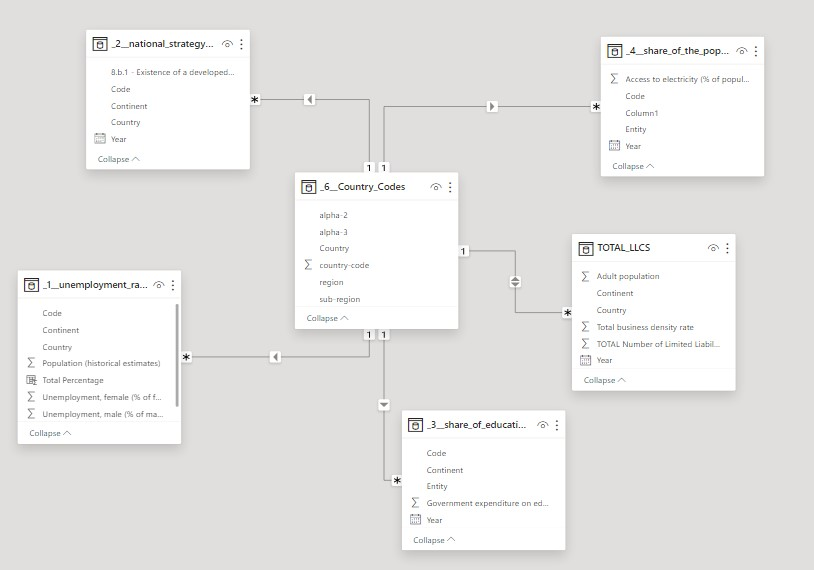
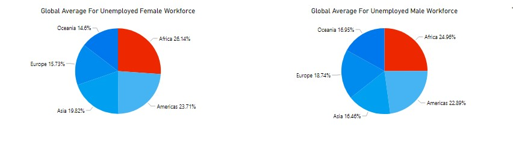
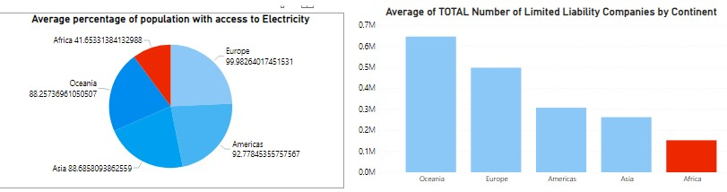
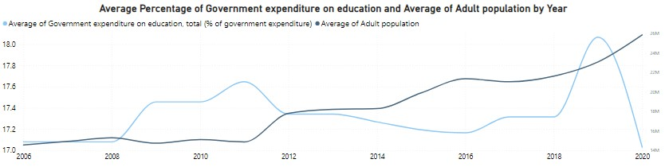

# Unemployment-in-Africa

## Introduction

I had the opportunity to join a hackathon which was hosted by 10Alytics, a data analytics company based in the United kingdom.  The hackathon focused on tackling unemployment in Africa, which is one of the Sustainable Development Goals (SDGs). Although I did not make it to the top 10 finalists, I enjoyed the experience and gained invaluable experience in the overall Project. 

## Problem Statement

African countries continue to face one of their biggest problems, which is unemployment. The topic is complex and has a foundation in elements relating to education, policy, and socioeconomic status. To find insights and ideas that may help mitigate the unemployment situation in Africa, the study used the many datasets that were provided to pinpoint critical areas where improvements need to be made.

## Key Objectives
1.	A historical perspective on unemployment in Africa
2.	What key Factors contribute to unemployment in Africa
3.	What are the current government policies geared towards tackling unemployment in Africa

## Skills Demonstrated
- Data Visualization
- Data Cleaning (python, Excel)
- Data Formatting

## Data Sourcing

The dataset was provided by the moderator. It included 5 CSV documents and 1 Excel workbook

## Data Cleaning
- **Blanks rows and Null Values:**  I used python in removing the blank rows in the table using this short code **_df.dropna (how='all', inplace=true)_** this code removes all blank rows in the dataframe without creating a new dataframe. Then I saved the changes to the excel file using **_df.to_excel(path)_**
  
- **Data Cleaning:** The excel data was very dirty which led to a lengthy data cleaning process. I initially started with excel to normalize the data using **VLOOKUP** to match states with IDs I created  then renamed all the columns to have identical column names.
  
- **Handling Inconsistencies:** The countries had different names across all 6 workbooks. (eg USA in one sheet, United States of America in another sheet, America in the next sheet). So I used find and replace to correct these inconsistencies thus making sure that the names were uniform across all tables.
  
- **Error handling:** in columns where I expect errors, (eg. I expected errors when using the vlookup to propagate my unique identifiers across all tables since some cells were blank). i wrapped all my formulas in an IFERROR statement to gracefully handle the errors 

- **Filling Blanks** I personally believe that not all blanks should be treated equally. In text columns where blanks occur,  I fill the column with “Others” while in columns where numerical data occur, I fill the columns with 0

## Modelling

Since I already cleaned the data in excel to great effect, I didn’t need to do any work using power query and when I imported the entire folder into power bi, the models were auto-generated with a 1 – to many star schema diagram 

## Findings

- In the historical analysis, As at 2021, Africa had the highest number of unemployed workforce for both male and female. An average of over 26% of the global unemployed female workforce were Africans while over 24% of the global unemployed male workforce were Africans. This implies that females have a slightly higher unemployment rate than males

- Unemployment rates in Africa have risen since 1991, with a significant increase from 2017 to 2021. This trend coincides with the Increase in the demand for new and emerging skillset which the labour market failed to fill (ILO) and then in 2019, the COVID-19 pandemic, which may have exacerbated unemployment. As of 2021, recovery from the pandemic’s economic impact appears incomplete.

## Key Factors Contributing to Unemployment
I was able to isolate three key factors that contribute to unemployment

1. **Electricity Supply**

while over 80% of residents of other countries have access to electricity, only 42% of Africans have access to electricity, leaving 58% of the continent's residents in the dark. Also, compared to other parts of the world.

2. **Availbability of Companies**
Africa only boasts of an average of 152,268 LLCs between 2006 and 2020 indicating that the economy of the continent thrives on MSME's which account for over 90% of the continent's Markets.

3. **Population vs Expenditure**
   
Between 2006 and 2020, the average adult population saw an upward trend, Conversely, the average government expenditure on education as a percentage of total government expenditure slightly decreased by 0.29% during the same period. This suggests that while the adult population was growing, the relative government spending on education was not keeping pace.

4. **Government Policies**

In 2019, there were 17 African nations that had implemented strategies to combat unemployment, with 6 of these countries having put these strategies into action, and an additional 17 in the process of formulating their own strategies. However, by 2022, the number of African countries with adopted strategies had decreased to just 7, with only 4 countries in the process of developing their own strategies. South Africa was the only country with an operationalized strategy to tackle unemployment.
The deduction from this is that there has been a significant reduction in the number of African countries that have adopted, operationalized, or are in the process of developing strategies to address unemployment from 2019 to 2022.

## Recommendations

- **Invest in Education:** Africa is the world's youngest population. Increasing government expenditure on education to match the growing adult population will  help equip the workforce with the new and emerging skillsets demanded by the labor market.
- **Improve Electricity Access:** Building new infrastructure and rehabilitating existing ones  to increase the production and delivery of electricity is a catalyst for business growth. Reliable power supply can stimulate economic growth by enabling the creation and expansion of businesses while reducing operation costs. 
- **Support MSMEs:** Given that Micro, Small, and Medium Enterprises (MSMEs) account for over 90% of the continent’s markets, policies should be put in place to support these businesses, which could lead to job creation.
- **Develop and Implement Unemployment Strategies:** Increase the number of countries adopting, operationalizing, and developing strategies to combat unemployment. Learning from the strategies of countries like South Africa will  be beneficial.
- **Promote Entrepreneurship:** Encourage entrepreneurship to create more job opportunities. This could be achieved through favorable policies, access to capital, and providing a conducive business environment.
- **Investment in Vocational and technical Education:** African Governments should strive to encourage her citizens to also embrace blue-collar jobs as an alternative to white collar jobs

## Conclusion
This hackathon tested my skills across different tools and methodologies. It afforded me the opportunity to hone my data analysis and cleaning skills. It also gave me the opportunity to engage and discuss with data professionals on problems that we can all relate with while finding solutions to them.
